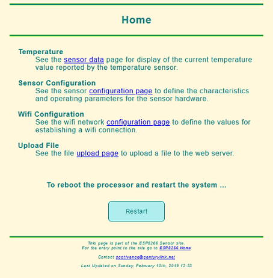

# Web Interface

The ESP8266 micro controller that hosts the temperature sensor system also runs a web server that provides an external interface to the system.  The system is configured through the web interface and there is also a graphical display of the current temperature provided.

The initial web page for the web interface looks like this

